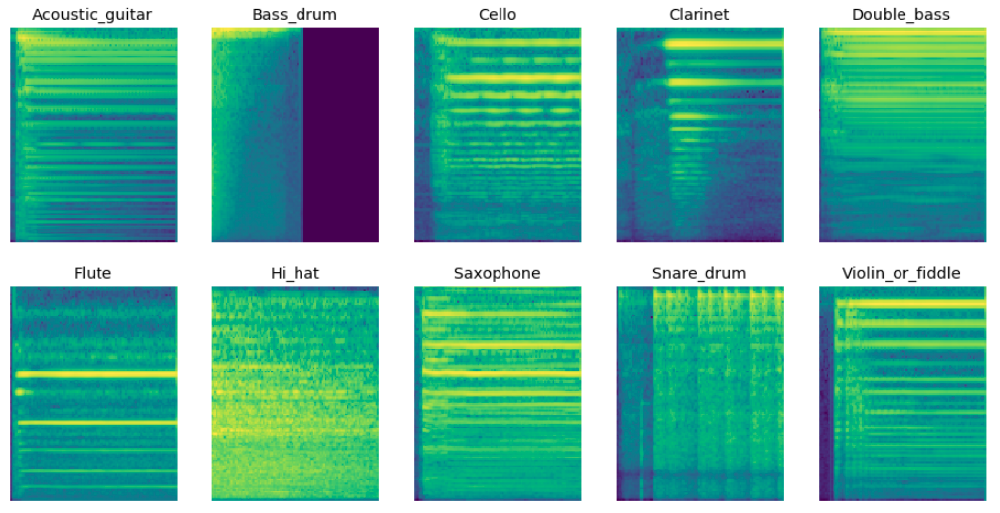
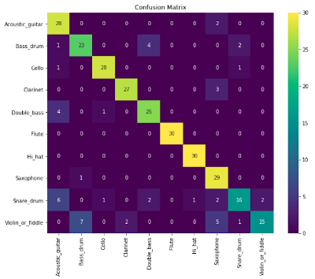
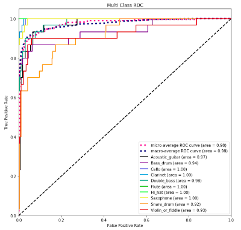

# Audio-Classification (Kapre Version)

Pipeline for prototyping audio classification algorithms with TF 2.3




### Environment

```
conda create -n audio python=3.7
activate audio
pip install -r requirements.txt
```

### Jupyter Notebooks

Assuming you have ipykernel installed from your conda environment

`ipython kernel install --user --name=audio`

`conda activate audio`

`jupyter-notebook`

### Audio Preprocessing

clean.py can be used to preview the signal envelope at a threshold to remove low magnitude data

split_wavs means a clean directory will be created with downsampled mono audio split by delta time

`python clean.py`

### Training

Change model_type to: conv1d, conv2d, lstm

Sample rate and delta time should be the same from clean.py

`python train.py`

### Confusion Matrix



### Receiver Operating Characteristic


